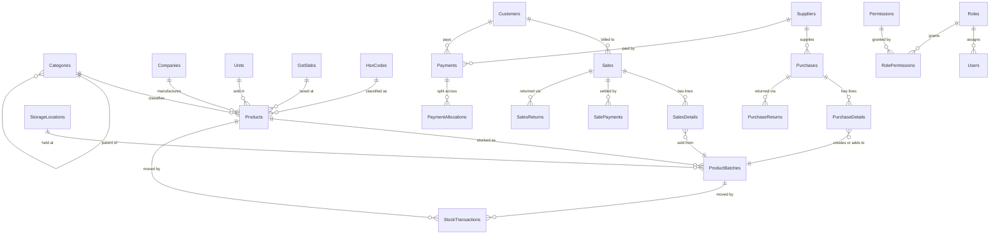

# AgriERP — Database Design

Design rationale for the Agriculture Shop ERP schema. Companion to `database/scripts/`.

> **Later restructure.** Products became Items and a group layer was added on top
> — see `docs/08-item-groups.md`. That work lives in scripts `14`–`17` as
> transforms of the existing shape; `04_Products.sql` and the rest of `00`–`13`
> still build the **original** tables, so a fresh install runs `00`→`17` in order
> and lands exactly where the live database is. This document describes the
> pre-restructure design that `00`–`13` create; read it first, then `08` for
> what changed.

---

## 1. Schema layout

Forty-six tables in a single `dbo` becomes unnavigable. Schemas also give a clean unit for permissions later — a salesman login can be granted `SELECT` on `mst` while being denied `fin` entirely.

| Schema | Holds | Tables |
|--------|-------|-------:|
| `sec` | Users, roles, permissions, tokens | 6 |
| `mst` | Reference and party masters, products, batches | 13 |
| `inv` | Stock journal, adjustments, transfers | 6 |
| `pur` | Purchase orders, purchases, returns | 6 |
| `sal` | Invoices, payment splits, returns | 5 |
| `fin` | Payments, allocations, expenses | 5 |
| `app` | Shop profile, financial years, numbering, audit | 5 |

`sys` is reserved by SQL Server, hence `app` for system configuration.

---

## 2. Three decisions that differ from the original field list

### 2.1 Batch, expiry and current stock left the Product Master

You listed `Batch Number`, `Manufacturing Date`, `Expiry Date` and `Current Stock` as Product Master fields. They are in `mst.ProductBatches` instead.

A product like *Confidor 17.8% SL 250ml* is purchased many times. Each consignment arrives with its own batch number, its own expiry date, and usually a different purchase rate. With those as columns on the product row:

- *"Which batches expire within 60 days?"* cannot be answered — there is only one expiry date, belonging to whichever purchase was entered last.
- The second purchase overwrites the first batch's expiry, so year-old stock silently inherits a fresh expiry date. For pesticides that is a compliance problem, not just a reporting one.
- Batch-wise profit is unknowable, because only one purchase rate survives.

So each physical lot is a row in `mst.ProductBatches`, unique on `(ProductId, BatchNumber, LocationId)`. Products with no real batches (a sprayer, a khurpi) still get one row with `BatchNumber = 'GEN'`, so every stock path in the application is identical — no `if (isBatched)` branch in the billing code.

Product Master keeps everything else you listed: all six rate columns, HSN, GST, min/max stock, rack, barcode, image, description.

### 2.2 Current stock and outstanding amount are derived, not stored

`Current Stock` on the product and `Outstanding Amount` on the customer are views, not columns.

A stored balance drifts. Someone edits a posted bill, a payment is reversed, a batch job half-completes — and the stored number silently stops matching the transactions behind it. Nobody notices until a farmer disputes his ledger.

- Product stock → `mst.vw_ProductStock`, summing `ProductBatches.CurrentQty`
- Customer outstanding → `mst.vw_CustomerOutstanding`
- Supplier outstanding → `mst.vw_SupplierOutstanding`

Both remain single-column reads for the API. `ProductBatches.CurrentQty` is itself a `PERSISTED` computed column (`InwardQty - OutwardQty`), so it is indexable and structurally unable to disagree with its own inputs.

### 2.3 Sale type and payment type are separate columns

You listed *Retail Sale / Wholesale Sale / Cash Sale / Credit Sale* as one list. They are two independent questions:

- **`SaleType`** — which price list applies: `Retail`, `Wholesale`, `Dealer`
- **`PaymentType`** — how it was settled: `Cash`, `Credit`

A wholesale sale on credit is an everyday transaction and one column cannot express it. `CK_Sales_CreditNeedsCustomer` then enforces the rule that actually matters: credit requires a named customer, never a walk-in.

---

## 3. Core entity relationships



---

## 4. The stock journal

`inv.StockTransactions` is **append-only**. Every movement — purchase, sale, return, adjustment, transfer, opening — is one row, and nothing ever updates or deletes a row. Cancelling a bill writes a *reversing* row linked by `ReversesTransactionId`; it does not erase history.

That single rule is what makes the rest of the system trustworthy:

- Stock at any past date is `SUM(SignedQuantity)` up to that date. Closing stock for 31-March is reproducible three years later.
- `ProductBatches.CurrentQty` is a running cache of this journal, and `inv.usp_RebuildBatchQuantities` can rebuild it from scratch to prove the cache is honest.
- *"Who reduced this stock and when"* is always answerable — which matters when the counter and the godown disagree.

### StockLedger vs StockTransactions

You listed both as tables. Two tables holding the same movements would be duplicate data — the thing you explicitly asked to avoid — so the **journal is the table** (`inv.StockTransactions`) and the **ledger is a view** (`inv.vw_StockLedger`, which adds the running balance via a window function). Same report, no second copy to reconcile.

### Batch picking is FEFO, not FIFO

`inv.usp_GetAvailableBatches` orders by **expiry date**, not receipt date. A pesticide expiring in two months must leave before one expiring in two years, regardless of which arrived first. Plain FIFO would quietly age stock into a write-off.

---

## 5. The money model

Identical in purchase, sales and both return documents.

**Per line:**
```
GrossAmount   = Quantity × Rate                                (persisted)
TaxableAmount = GrossAmount − DiscountAmount                   (persisted)
tax amounts   = TaxableAmount × rate ÷ 100                     (written by API)
LineTotal     = TaxableAmount + CGST + SGST + IGST + Cess      (persisted)
```

**Per header:**
```
GrandTotal    = TaxableAmount + taxes + Freight + Other + RoundOff   (persisted)
BalanceAmount = GrandTotal − PaidAmount                              (persisted)
PaymentStatus = Unpaid | Partial | Paid                              (persisted)
```

Everything that is arithmetic is a `PERSISTED` computed column. This is where ERPs usually rot: the UI computes a total, the API recomputes it slightly differently, a later patch changes one and not the other, and the printed bill stops matching the stored total. Here the database owns the arithmetic.

### GST

`IsInterState` decides CGST+SGST versus IGST, derived from the shop's state code (`app.CompanyProfile.StateId`) against the party's. Both column sets exist on every document because **GST returns are filed on what was charged, not on what would be charged today** — a rate change next year must not restate last year's invoices.

`CK_Purchases_TaxMode` and `CK_Sales_TaxMode` enforce it: an inter-state document carries IGST only, an intra-state one never does.

### Cost is frozen onto the sale line

`sal.SalesDetails.CostRate` is the landed rate of the batch that left the shelf, copied at the moment of sale. Profit reports read it directly.

Deriving profit later from the product's *current* purchase rate would silently restate last year's profit every time a new consignment arrives at a different price — a classic and very hard-to-notice reporting bug.

Free goods carry cost but earn nothing, so `CostAmount` is charged on `Quantity + FreeQuantity` while revenue is on `Quantity` alone.

---

## 6. Document numbering

Invoice numbers cannot have gaps and cannot repeat — a GST auditor will ask.

`MAX(InvoiceNumber) + 1` breaks the moment two salesmen bill simultaneously: both read the same maximum. `app.NumberSeries` holds the counter and `app.usp_GetNextDocumentNumber` increments it in **one atomic UPDATE statement**, so SQL Server's own exclusive lock serialises concurrent callers. Series reset per financial year, producing `INV/2026-27/00042`.

Master codes (product, customer, supplier) do not carry a year — a product created last year keeps its code forever.

---

## 7. Security model

Permissions are stored as codes (`Product.Create`, `Sales.OverrideMinRate`), not booleans per screen. Adding a module later means inserting rows, never altering a table. 70 permissions across 11 modules.

Seeded role boundaries:

| Role | Cannot |
|------|--------|
| Administrator | — |
| Manager | Administer users, close the financial year |
| Salesman | Cancel a posted invoice, sell below minimum rate, see profit figures, touch purchase or stock |
| StoreKeeper | Bill, collect money, see any financial report |

Manager is excluded from user administration *and* year-end close deliberately, so one person cannot both create a login and close the books against it.

Refresh tokens are stored as SHA-256 hashes. A leaked database backup must not hand an attacker live sessions.

---

## 8. Concurrency and integrity

- **RCSI is on.** Long-running reports (stock ledger, GST returns) use row versions instead of shared locks, so a month-end report cannot block the billing counter.
- **`ROWVERSION` on every mutable table** for optimistic concurrency — EF Core maps it to `IsRowVersion()`, and two users editing the same product produce a clean conflict rather than a silent overwrite.
- **Soft delete** (`IsDeleted`) on masters, with **filtered unique indexes** (`WHERE IsDeleted = 0`) so a deleted code can be reused.
- **`UPDLOCK` on the batch row** inside `usp_PostStockTransaction`. Two concurrent sales of the last packet both reach it; the second waits, re-reads the reduced quantity, and is correctly rejected.
- **`UQ_Purchases_Supplier_InvoiceNumber`** blocks entering the same supplier bill twice — the most common and most expensive data-entry error in a purchase module.

---

## 9. Verification

`database/tests/smoke_test.sql` creates a throwaway product, moves stock through it, asserts ten invariants, and deletes everything it created. Current status — all passing:

```
PASS  1. Inward posting updated batch quantities (50 + 20).
PASS  2. vw_ProductStock rolled up 70 units valued 26,440.00 at batch cost.
PASS  3. FEFO offered ZZB-EARLY (expires 2026-11-30) before ZZB-LATE.
PASS  4. Outward posting reduced ZZB-EARLY from 20 to 12.
PASS  5. vw_StockLedger running balance closed at 62.
PASS  6. Overselling refused (error 50024) and stock left untouched.
PASS  7. Cancellation restored stock to 20 by appending a reversal, not deleting.
PASS  8. usp_RebuildBatchQuantities found zero drift between cache and journal.
PASS  9. Numbering produced INV/2026-27/00001 then INV/2026-27/00002.
PASS 10. Money model arithmetic: taxable 4,275.00 / total 5,044.50 / profit 475.00.
```

---

## 10. Module coverage

| Module | Tables / views |
|--------|----------------|
| 1. Dashboard | `app.usp_DashboardSummary` (6 result sets), `vw_DailySalesSummary`, `vw_DailyPurchaseSummary`, `vw_CategoryWiseStock` |
| 2. Category Master | `mst.Categories` (self-referencing hierarchy) |
| 3. Company Master | `mst.Companies` |
| 4. Supplier Master | `mst.Suppliers`, `vw_SupplierOutstanding` |
| 5. Customer Master | `mst.Customers`, `vw_CustomerOutstanding` |
| 6. Product Master | `mst.Products`, `ProductBatches`, `ProductImages`, `ProductPriceHistory` |
| 7. Stock Management | `inv.StockTransactions`, `StockAdjustments`, `StockTransfers`, `vw_StockLedger`, `vw_BatchStock` |
| 8. Purchase | `pur.PurchaseOrders`, `Purchases`, `PurchaseReturns` + details |
| 9. Sales | `sal.Sales`, `SalesDetails`, `SalePayments`, `SalesReturns` |
| 10. Inventory Reports | `vw_ProductStock`, `vw_LowStockProducts`, `vw_OutOfStockProducts`, `vw_NearExpiryStock`, `vw_ExpiredStock`, `vw_CompanyWiseStock` |
| 11. Reports | `vw_GstSalesSummary`, `vw_GstPurchaseSummary`, daily summaries, profit columns on `sal.Sales` |
| 12. User Management | `sec.Users`, `Roles`, `Permissions`, `RolePermissions` |
| 13. Authentication | `sec.Users`, `UserRefreshTokens`, `UserPasswordResets` |

---

## 11. Deliberately deferred

- **Weighted-average costing.** `app.AppSettings` carries `Purchase.CostingMethod` with `Batch` as the default. Batch costing is more accurate and is what the schema implements today; weighted average would need a separate valuation table.
- **Multi-branch.** `mst.StorageLocations` supports several godowns within one shop, but not separate GST registrations per branch.
- **E-way bill / e-invoice IRN fields.** Not required at a village agri-shop's turnover; they would be additive columns on `sal.Sales` when needed.
